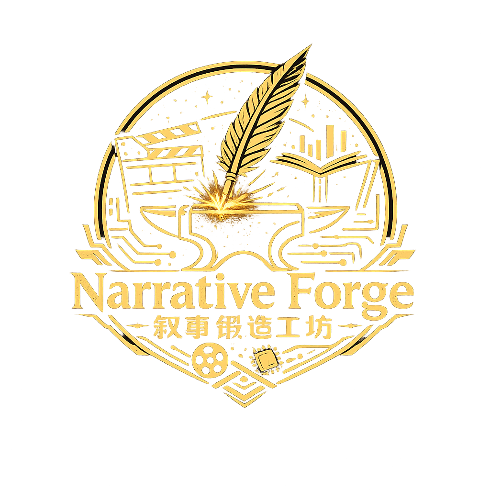

<div align="center">
  

  # Narrative Forge

  A local, human-in-the-loop directing workspace for interactive stories and AI short dramas

  [](#project-status)
  [](https://www.python.org/)
  [](#quick-start)
  [](release/NarrativeForge-Setup.exe?raw=1)
  [](#license)

  [简体中文](README.md) · **English**
</div>

## Overview

Narrative Forge brings story planning, shot editing, keyframe generation, image-to-video generation, asset management, interactive previews, and final exports into one browser-based workspace.

It is designed for independent creators, small teams, and prototype developers who want a local workflow from narrative concept to a playable interactive release or an exported short-drama episode. No database is required, and project data, generated media, and exports remain on the local machine by default.

## Features

### Interactive Stories

- Generate and edit story graphs with choices, transitions, and multiple endings.
- Configure story-tree depth and the number of branches per node.
- Reorder shots and same-level story nodes with drag and drop.
- Browse, zoom, and inspect the complete narrative graph in fullscreen.
- Preview from any node in landscape or `9:16` portrait layouts.
- Export a self-contained offline player as a ZIP archive.

### AI Short Dramas

- Work with a three-level structure: project, episode, and individual shot.
- Define an independent synopsis, objective, opening hook, climax, and shot count for each episode.
- Generate only the active episode with either an AI model or a local template.
- Reuse character references across episodes for improved visual consistency.
- Manage entry states, exit states, and transitions between adjacent shots.
- Assemble the active episode into an MP4 file with FFmpeg.

### AI and Asset Workflow

- Configure text, text-to-image, reference-image editing, and image-to-video models independently.
- Merge performance, dialogue, and continuity requirements into generation prompts.
- Track generation tasks per shot, stop local polling, and resume status checks later.
- Preview, save, download, delete, and regenerate images and videos.
- Save projects locally and import or export project JSON files.

## Quick Start

> **Windows users:** [Download the installer](release/NarrativeForge-Setup.exe?raw=1) · [Browse releases and checksums](release/)

### Requirements

- Windows 10/11
- Python 3.10 or later
- A modern web browser
- At least one compatible model provider and API key
- FFmpeg, required only for short-drama episode exports

### One-Click Launch

Double-click `start.bat` in the project root. The launcher will:

1. Check the installed Python version.
2. Create a project-local `.venv`.
3. Install missing dependencies.
4. Start the local service and open the browser.

Manual startup is also available:

```powershell
python -m pip install -r requirements.txt
python app.py
```

Then open <http://127.0.0.1:8000>.

### API Keys

To use a shared AtlasCloud key:

```powershell
$env:ATLASCLOUD_API_KEY="your-api-key"
```

Separate provider keys are also supported:

```powershell
$env:TEXT_MODEL_API_KEY="your-text-key"
$env:IMAGE_MODEL_API_KEY="your-image-key"
$env:VIDEO_MODEL_API_KEY="your-video-key"
```

Keys entered in the UI are stored only in the current tab's `sessionStorage`. They are not written to project files or exported releases.

## Provider Compatibility

| Model type | Required protocol |
| --- | --- |
| Text | OpenAI-compatible Chat Completions API |
| Text-to-image / reference editing | AtlasCloud asynchronous `generateImage` protocol |
| Image-to-video | AtlasCloud asynchronous `generateVideo` protocol |
| Task polling | AtlasCloud `prediction/{id}` protocol |

Text, image, and video models may use different providers. Changing only the base URL is not enough for providers with incompatible request or response formats; those providers require a backend adapter.

## Typical Workflows

### Interactive Story

1. Define the synopsis, visual direction, and recurring characters.
2. Configure providers and generate a draft story graph.
3. Edit nodes, choices, and transitions, then validate the graph.
4. Generate a character master image before producing later keyframes and videos.
5. Test multiple paths and export the offline player package.

### AI Short Drama

1. Define the series and create an episode plan.
2. Set the active episode's objective, hook, ending, and shot count.
3. Generate and refine the shot list, keeping one narrative beat per shot.
4. Review character references, continuity states, and transitions.
5. Generate media shot by shot, then export the active episode as MP4.

## Windows Installer

### Download

- [Download NarrativeForge-Setup.exe](release/NarrativeForge-Setup.exe?raw=1)
- [Open the release directory](release/)
- [Read installation and checksum information](release/README.md#english)

Python 3.10 or later must already be installed on the target computer.

### Build from Source

An [Inno Setup](https://jrsoftware.org/isinfo.php) script is included. After installing Inno Setup 6, run:

```powershell
& "C:\Program Files (x86)\Inno Setup 6\ISCC.exe" "installer\setup.iss"
```

The installer is generated at `release/NarrativeForge-Setup.exe`. Python is not bundled, so the target computer must have Python 3.10 or later installed. After rebuilding a release, update the file size and SHA-256 value in [release/README.md](release/README.md).

## Data and Security

- Projects and generated assets remain local by default.
- API keys are not written to project JSON, media folders, or release packages.
- Release packages omit provider settings, prompts, and internal task metadata.
- The local service has no account system or access control and should not be exposed directly to the public internet.
- Do not commit `.env`, `projects/`, real API keys, or user media.

## Development and Contributing

Issues and pull requests are welcome. Run the test suite before submitting changes:

```powershell
python -m unittest -v backend.test_server
```

See [development.md](development.md) for the project structure, runtime design, data model, APIs, and extension guidelines.

## Project Status

Narrative Forge is currently in **Alpha**. It is suitable for personal creation and prototyping. Generated media still requires human review, and image/video providers currently need to support the AtlasCloud asynchronous protocol.

## License

This repository does not currently include an open-source license. Until a `LICENSE` file is added by the maintainer, the code should not be considered licensed for copying, modification, or redistribution.
